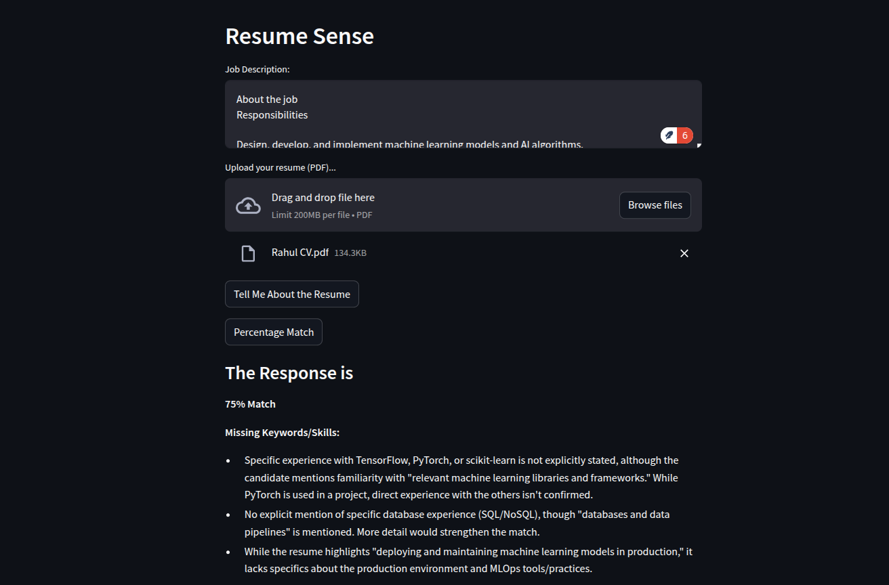

# ResumeSense: AI-Powered ATS Resume Analyzer

<p align="center">
  
</p>

## Introduction
ResumeSense is an AI-powered Applicant Tracking System (ATS) resume analyzer that evaluates a candidate's resume against a given job description. It leverages OpenAI's Gemini API to provide detailed feedback on resume strengths, weaknesses, and a percentage match to the job description. The tool enables job seekers to optimize their resumes for ATS systems used by recruiters, increasing their chances of landing interviews.

---

## Features
- Upload Resume (PDF): Users can upload their resume in PDF format.
- Job Description Input: Users can enter a job description for comparison.
- ATS Evaluation: AI-powered analysis of resume fit against the job description.
- Match Percentage Calculation: The system returns a percentage match score and highlights missing keywords.
- Insights and Suggestions: AI-generated recommendations for improving the resume.

---

## Use Cases
1. Job Seekers: Optimize resumes for a higher ATS score and improved hiring chances.
2. HR Professionals: Evaluate candidate resumes efficiently using AI-driven analysis.
3. Career Coaches: Provide insights and guidance to clients based on AI-powered feedback.
4. Recruiters: Pre-screen resumes against job descriptions before shortlisting candidates.

---

## Project Directory Structure
```
ResumeSense-AI-Powered-ATS-Resume-Analyzer/
│── app.py                        # Main Streamlit application
│── config/                        # Configuration files
│   │── __init__.py                
│   │── settings.py                # API key and environment variables
│   └── __pycache__/               # Compiled Python files
│── utils/                         # Utility scripts
│   │── __init__.py                
│   │── gemini_api.py              # API interaction with Gemini AI
│   │── pdf_processing.py          # Resume PDF processing
│   │── resume_evaluation.py       # Resume evaluation functions
│   └── __pycache__/               # Compiled Python files
│── requirements.txt               # Python dependencies
│── LICENSE                        # License file
│── README.md                      # Documentation
```

---

## Setup Instructions

### 1. Install Python (if not installed)
Ensure you have Python 3.10+ installed on your system. You can download it from [Python's official site](https://www.python.org/downloads/).

### 2. Clone the Repository
```sh
git clone https://github.com/devrahulbanjara/ResumeSense-AI-Powered-ATS-Resume-Analyzer.git
cd ResumeSense-AI-Powered-ATS-Resume-Analyzer
```

### 3. Create a Virtual Environment
It is recommended to use a virtual environment for dependency management.
```sh
python -m venv venv
source venv/bin/activate  # On macOS/Linux
venv\Scripts\activate    # On Windows
```

### 4. Install Dependencies
```sh
pip install -r requirements.txt
```

### 5. Set Up Environment Variables
Create a `.env` file in the root directory and add your Gemini API key:
```sh
echo "GEMINI_API_KEY=your_api_key_here" > .env
```
Alternatively, create the file manually and add:
```
GEMINI_API_KEY=your_api_key_here
```

### 6. Run the Application
```sh
streamlit run app.py
```
This will launch the ResumeSense application in your web browser.

---

## Detailed Module Breakdown

### 1. Application Entry Point (`app.py`)
- Sets up the Streamlit UI.
- Allows users to upload a resume and enter a job description.
- Calls functions for resume evaluation and percentage match.

### 2. Configuration (`config/settings.py`)
- Loads API keys and environment variables using `dotenv`.

### 3. Utility Modules (`utils/`)
#### `gemini_api.py`
- Handles communication with the Gemini API.
- Uses the configured API key to generate responses based on input.

#### `pdf_processing.py`
- Converts uploaded PDF resumes into images for AI processing.
- Encodes images into a format suitable for the API.

#### `resume_evaluation.py`
- Compares the resume against the job description.
- Provides AI-generated insights and calculates percentage match.

---

## Example Usage
### 1. Upload a Resume and Provide a Job Description
- Enter the job description in the text area.
- Upload a PDF resume.

### 2. Click on "Tell Me About the Resume"
- AI evaluates resume strengths and weaknesses.
- Provides detailed feedback on how well it fits the job description.

### 3. Click on "Percentage Match"
- AI calculates a match score.
- Lists missing keywords and final recommendations.

---

## Troubleshooting
### Issue: `ModuleNotFoundError`
Ensure dependencies are installed:
```sh
pip install -r requirements.txt
```

### Issue: `.env` Variables Not Loaded
Ensure `.env` file is correctly formatted and contains the `GEMINI_API_KEY`.
Try reloading:
```sh
source venv/bin/activate
```

### Issue: Streamlit Not Found
Activate virtual environment before running:
```sh
source venv/bin/activate  # macOS/Linux
venv\Scripts\activate    # Windows
```
Then run:
```sh
streamlit run app.py
```

---

## License
This project is licensed under the MIT License. See the [LICENSE](LICENSE) file for details.

---

## Contributing
We welcome contributions! To contribute:
1. Fork the repository.
2. Create a feature branch.
3. Commit your changes.
4. Push to your branch.
5. Open a Pull Request.

---

## Contact
For any inquiries or issues, please reach out:
- Email: rdbanjara07@gmail.com
- LinkedIn: [linkedin.com/in/devrahulbanjara](https://linkedin.com/in/devrahulbanjara)

---

### Happy Resume Optimization!

